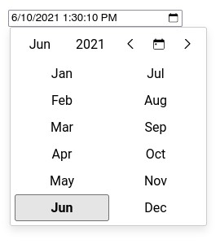
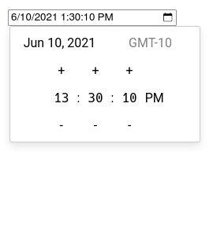
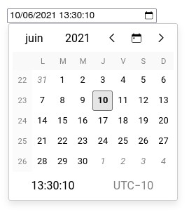
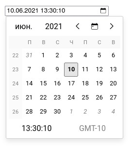
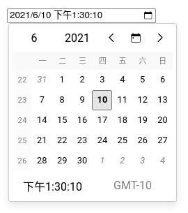

# @jalik/react-datetime-input


[](https://github.com/jalik/react-datetime-input/issues)


## Introduction

This lib allows you to add datetime inputs in your React applications with the following advantages.

- Available in CJS and ESM (tree shakeable)
- Multiple selection modes (year, month, day, time)
- Support for min and max datetime
- Customizable datetime format
- Customizable view (locale, week numbers, timezone...)
- Works like a normal input (onChange/value)
- Based on Intl API to support any language (English, French, Chinese...)
- Based on [luxon](https://moment.github.io/luxon/) for date and time manipulation

**NOTICE : This only work with controlled components.**

Some examples of use.





Support for different languages.







## Quickstart

The code below shows how to add a datetime input field with a default value and handling its
changes.

```js
import { DateTimeInput } from '@jalik/react-datetime-input';
import React, {
  useCallback,
  useState
} from 'react';

// Don't forget to load default styles.
import '@jalik/react-datetime-input/src/styles.css';

function App() {
  const [date, setDate] = useState(new Date().toISOString());

  const handleChange = useCallback((event) => {
    setDate(event.target.value);
  }, [])

  return (
    <div>
      <DateTimeInput
        format="D tt"
        locale="fr"
        name="date"
        onChange={handleChange}
        showCalendarIcon
        showCalendarOnFocus
        showTimeZone
        showWeekNumbers
        value={date}
      />
    </div>
  )
}
```

### Props

#### `calendarIcon: string`

Allow to change the calendar icon in the input field.

#### `disabled: bool`

Set to `true` to avoid changes of the input value.

#### `format: string`

Allow to set a custom format for parsing/formatting the date in the input field.  
Formatting is based on
Luxon (https://moment.github.io/luxon/docs/manual/formatting.html#table-of-tokens).  
The default value is `D tt` (localized date and time).

#### `locale: string`

Allow to set the language of the calendar (based on the **Intl API**).  
The default value is `navigator.language` if available.

#### `max: string`

Pass an ISO date string that is the maximal valid datetime.

#### `min: string`

Pass an ISO date string that is the minimal valid datetime.

#### `renderDay: function`

Pass a function or functional component to customize days rendering.

#### `showCalendarIcon: bool`

Set to `true` to display the calendar icon in the input field.

#### `showCalendarOnFocus: bool`

Set to `true` to open the calendar when the input receives the focus (by click or keyboard).

#### `showTimeZone: bool`

Set to `true` to display the current timezone in the calendar.

#### `showWeekNumbers: bool`

Set to `true` to display week numbers in the calendar.

#### `value: string`

Used to pass the date in the format defined with `format`.

## Customization

### `renderDay: function`

The example below shows how to disable selection of week-end days.

```js
import {
  CalendarDay,
  DateTimeInput
} from '@jalik/react-datetime-input';
import React, {
  useCallback,
  useState
} from 'react';

// Don't forget to load default styles.
import '@jalik/react-datetime-input/src/styles.css';

// Custom component that renders week-end days in red.
function CustomDayCell(props) {
  const { dateTime, currentMonth, selectedDateTime } = props;
  const isWeekEnd = dateTime.weekday > 5;
  const style = isWeekEnd ? { color: 'red' } : {};
  // We use the default component for rendering day, so we have less code to write.
  // But we could use another component with a complete different logic.
  return <CalendarDay {...props} style={style} />;
}

function App() {
  const [date, setDate] = useState(new Date().toISOString());

  const handleChange = useCallback((event) => {
    setDate(event.target.value);
  }, [])

  return (
    <div>
      <DateTimeInput
        name="date"
        onChange={handleChange}
        renderDay={CustomDayCell}
        value={date}
      />
    </div>
  )
}
```

## Changelog

History of releases is in the [changelog](./CHANGELOG.md).

## License

The code is released under the [MIT License](http://www.opensource.org/licenses/MIT).
